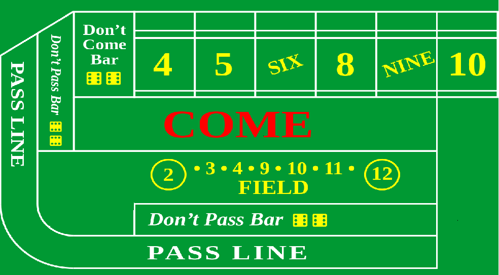

# Jogo CRAPS

 

**Data:**
04/07/2017

## Descrição do projeto
Desenvolvimento de um programa que permite disputar apostas no jogo de cassino chamado CRAPS entre dois usuários.UFSC - INE5608

## Autor
Bruno Aurélio Rôzza de Moura Campos

## Sumário
1. Requisitos do sistema
2. Instalação
3. Versão atual e seus aspectos
4. Restrições
5. Melhorias para próximas versões

**1. Requisitos do sistema**

Para executar o jogo é necessário:
 - Java Runtime Environment (JRE) instalado na máquina, na versão 8 ou superior.
 - Conexão com a internet para jogar com outros usuários em rede ou executar o aplicação.
 - 2 arquivos necessariois: NetGamesFileOffline.jar + servidor.jar do NetGames.

**2. Instalação e execução**

 - Não é necessário instalar o jogo para que ele seja executado.
 - É possível gerar o arquivo jar, executando o comando neste repositório: `mvn clean install`
 - Para executar o jogo há duas possibilidades:

1. Diretamente no arquivo "game_CRAPS.jar" (que consta na pasta Executavel) considerando as restrições:
	Se  "Java platform SE binary" estiver definido como programa padrão para abrir arquivo: Dar duplo clique em "game-craps.jar";
	Caso contrário: Clicar com o botão direito do mouse no arquivo "game_CRAPS.jar" e clicar em "Abrir com..." para procurar o JRE 8 em seu computador. 
OBS: veja como esta o PATH que indica o arquivo ngnrtFramework.jar no pom.xml

2. Através da linha de comando:
	No diretório onde consta o arquivo "game_CRAPS.jar" executar o comando (`java -jar servidor.jar`)

-Para iniciar uma partida faca o seguinte:

 - No menu no canto superior esquerdo escolha a opção Conectar.
 - Defina o nome do jogador.
 - Defina o nome do servidor

**3. Versão atual e seus aspectos**
- O jogo encontra-se na sua primeira versão com uma interface simples e funcional.
- Número de jogadores suportado: 2.
- Ambos jogadores devem se conectar ao servidor "venus.inf.ufsc.br" ou "localhost".
- Um dos jogadores deve iniciar a partida, e este mesmo iniciará jogando.
- São habilitados as apostas "PASS LINE"  e "DONT PASS LINE" na primeira rodada.
- A mesa é composta pela mesa de aposta, painel de lancamento de dados e a lista de apostas de cada jogador.
- Em cada jogada, o jogador realiza as apostas, podendo alterar a possibilidade de apostas se der uma jogada POINT.
- Uma partida é composta por uma rodada, que pode encerrar se sair 7 ou 11 ou POINT.
- O jogador sempre vencera a rodada se o valor dos dados der POINT e sempre perdera se der 7 ou 11 apos a primeira rodada.

**4. Restrições**
- a conexão distribuída

**5. Melhorias para próximas versões**
- Melhorar a interface gráfica: Adicionar mensagens facilitando o entendimento das possíveis jogadas que o usuário pode fazer e tambem transferir a imagem dos dados para o adversario.
- Melhorar as imagens das apostas, para que cada click seja inserido uma ficha a mais na aposta.

---

 

 

